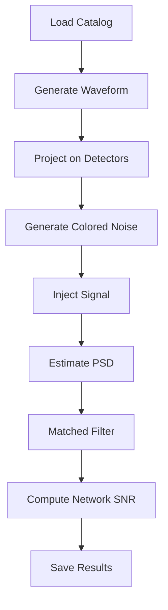

# Impact of local noise on astrophysical reach

## Project Overview

This repository contains all the material used for the analysis of the paper **_The impact of local noise recorded at the ET candidate sites on the signal to noise ratio of CBC gravitational wave signals for the ET triangle configuration_**.

This Python application simulates gravitational-wave observations for future detector networks based on the Einstein Telescope (ET) concept.
The pipeline generates astrophysical waveforms from compact binary coalescences, injects them into simulated detector noise, and evaluates the detectability of each event through matched-filter signal-to-noise ratio (SNR) calculations.
The code was developed to study the impact of different detector configurations and environmental noise conditions on the observability of gravitational-wave sources.

The sensitivity curves of the detector are modified using the ET noise budget created with GWINC and available at `git clone https://gitlab.et-gw.eu/et/isb/interferometer/ET-NoiseBudget`. We substiuted the NN contribution with Equation 1 of the paper to get the new sensitivity curves.

More detailed information about this repository's scientific context can be found in the `docs/` folder.

## Project content

### catalogs

This folder should contain the astrophysical catalogs that were used for the COBA paper and that are at the basis of this work. Nevertheless, the .h5 files are too heavy to be uploaded on GIT. A readme with the link to the ET TDS entry of the catalog is available instead. The catalogs are three files:

- 18321_1yrCatalogBBH.h5
- 18321_1yrCatalogBNS.h5
- 18321_1yrCatalogBNSmassGauss.h5

The first one contains binary black holes. The last two binary neutron stars, the only difference being the mass distribution. For this work, the first two were used. A jupyter notebook with sample instructions to read the .h5 files and visualize the parameter distribution is also available in this folder.

### sens_curves

This folder contains the ET design sensitivity curves modified with local seismic noise according to Equation 1 of _The impact of local noise recorded at the ET candidate sites on the signal to noise ratio of CBC gravitational wave signals for the ET triangle configuration_. The file `ET_ALL_NB.txt` contains the design sensitivity curve used for this work that is based on that used for the COBA paper. The `ET-0000A-18_ETDSensitivityCurveTxtFile.txt` file contains the ET-D design curve. The file `ETNoise_P2TERZ_1year.mat` contains the modified sensitivity curves from 2 Hz to 10 Hz used for this work and based on `ET_ALL_NB.txt` for the 10th, 50th and 90th percentile of the seismic noise spectra recorded at the candidate sites. The other `.txt` files are extracted from this file using the notebook `read_sens_curves_from_mat_to_txt.ipynb` in the folder notebooks. The files `ETNoise_P2TERZ.mat` and `ETNoise_P2TERZ_Att3.mat` contain the same thing as the `ETNoise_P2TERZ_1year.mat` but computed on 1 month only and for 1 year using a NN attenuation factor of 3, respectively. These latter files are for testing purposes only.

### notebooks

This folder contains the following Jupyter notebooks:

- `read_outputs.ipynb` some examples on how to read the `.pkl` files with the ouput of the CBC SNR analysis
- `read_sens_curves_from_mat_to_txt.ipynb` reads the modified ET sensitivity curves in the `.mat` files and converts them into `.txt` files
- `Sources.ipynb` examples on how to read the astrophysical catalogs.

### scripts

This folder contains one scripts

- `generate_wf_for_et_BBH_triangle_pythonic_test_dist_v5_opt.py`

This is the main code of the analysis, in particular:

- it reads the events from the COBA catalogs;
- selects the events of interest for the paper;
- generates the waveforms and projects them onto the fictional ET defined in the code to take into account the antenna patterns;
- generates white noise colored with the modified sensitivity curve for each detector in the network;
- injects the signals into noise;
- calculates the matched filter SNR in the frequency range of interest;
- calculates the time to merger when the signal reaches the SNR threshold;

To ensure the repeatability of the analysis and of the results, each time the code runs the noise is generated using the same random seed.

### pkl

The `yml/ ` folder contains a `pycbc.yml` file to generate an appropriate conda environment to run the analysis and includes only the essential modules. The analysis works also on the `igwn` environment available at: `https://computing.docs.ligo.org/conda/environments/`. This contains also modules which are not needed and may require some time to create the virtual environment (see also next section).

## Example command

`python generate_wf_for_et_BBH_triangle_pythonic_test_dist_v5_opt.py [-config [-case]] [-source_type]`

### Required arguments

| Argument       | Description                             |
| -------------- | --------------------------------------- |
| `-case`        | Detector site (SOS or TERZ) (not needed if config = 2L)             |
| `-config`      | Detector configuration (TRIANGLE or 2L) |
| `-source_type` | Source population (BBH or BNS)          |
| `-plots`       | Enable diagnostic plots                 |

## Workflow

## Key Dependencies
The code relies on several scientific Python libraries:
### Gravitational-Wave Analysis
* PyCBC
* GWPy
* LALSuite
### Scientific Computing
* NumPy
* SciPy
* h5py
### Visualization
* Matplotlib
* Astronomy
* Astropy

### Installation using conda

`conda create --file ./yml/pycbc.yml`
